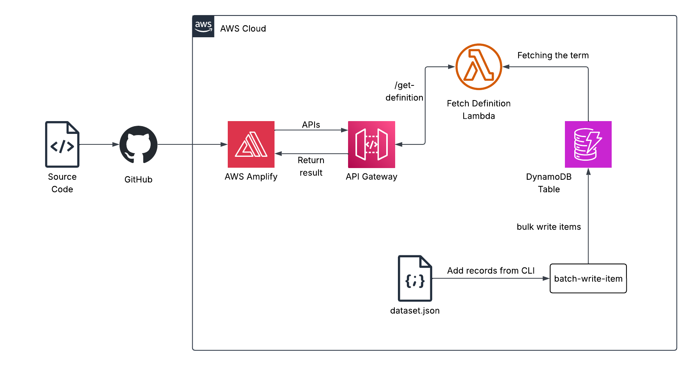
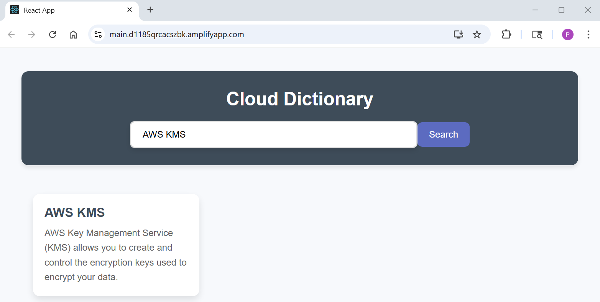

# AWS Serverless Cloud Dictionary 
A full-stack **serverless web application** that allows users to search for definitions of cloud computing services and terms. The front-end React app is hosted on **AWS Amplify**, while the back-end uses a **Lambda function** and **API Gateway** to query a **DynamoDB** database populated with dictionary terms.  

## Architecture Overview
  
*Figure 1: Architecture diagram of the Cloud Dictionary application.*  

- **AWS Amplify** – Hosts and continuously deploys the React front-end from GitHub.  
- **Amazon DynamoDB** – NoSQL database storing cloud definitions (`term` → `definition`).  
- **AWS Lambda** – Backend logic for querying terms from DynamoDB.  
- **Amazon API Gateway** – Provides a REST API endpoint for the front-end, with CORS enabled.  
- **AWS IAM** – Manages permissions for the Lambda function, including DynamoDB read-only access.  
 
## Skills Applied
- Designing and implementing serverless architectures.  
- Building and deploying a React application with AWS Amplify.  
- Creating and managing IAM roles with least-privilege policies.  
- Implementing API Gateway with Lambda proxy integration and CORS configuration.  
- Populating DynamoDB tables programmatically using the AWS CLI and Terraform provisioners.  
- Debugging and troubleshooting AWS services (permissions, environment variables, API Gateway integrations).  

## Features
- **Searchable dictionary of cloud services and terms** (e.g., AWS KMS, Amazon Cognito).  
- **Fully serverless stack** – no traditional servers required.  
- **Continuous deployment** from GitHub via AWS Amplify.  
- **Cross-origin resource sharing (CORS)** enabled API Gateway for React front-end integration.  
- **Local testing support** – React app can be run locally (`npm start`) before deploying.  

## Tech Stack
- **Languages:** Python 3.12, JavaScript (React 19.1)  
- **AWS Services:** Amplify, DynamoDB, Lambda, API Gateway, IAM  
- **IaC Tool:** Terraform  
- **Other Tools:** AWS CLI, GitHub  

## Deployment Instructions
> **Note:** All command-line examples use `bash` syntax highlighting to maximize compatibility and readability.  

> If you are using PowerShell or Command Prompt on Windows, the commands remain the same but prompt styles may differ.  

### React Front-End
1. Clone this repository.  
   
2. Navigate to the `clouddictionaryapp/` folder and install dependencies:  
   ```bash
   cd clouddictionaryapp
   npm install
   ```
   
3. *(Optional)* Test the application locally. The command should open the app in a browser at http://localhost:3000:  
   ```bash
   npm start
   ```
  
4. Create a new repository in GitHub and push the code using Git:  
   ```bash
   git init
   git add .
   git commit -m "initial commit"
   git remote add origin git@github.com:<your-username>/clouddictionaryapp.git
   git branch -M main
   git push -u origin main
   ```
   
5. Deploy your Application to Amplify.  
	- In the AWS Management Console, go to the Amplify console and click **Deploy an app**.  
	- Select GitHub for **Deploy your app** and authenticate when prompted. Select the newly created GitHub repository and branch.  
	- Click **Save and deploy**.  

### Terraform
6. Edit variables in `terraform.tfvars` and/or `variables.tf` to customize the deployment. **Note:** The DynamoDB table name is CloudDictionary, and it is set in each of the record json files. If changing the name of the DynamoDB table, the record json files will need to be updated.  

7. Navigate to the `terraform` folder and deploy:  
   ```bash
   cd terraform
   terraform init
   terraform plan # Optional, but recommended.
   terraform apply
   ```

### Testing
8. Replace the `apiURL` constant in "clouddictionaryapp\src\App.js" with the API URL from the Terraform output.  
   
9. Push the changes to the GitHub repository.  
   ```bash
   cd ..
   git add .
   git commit -m "Integrate API Gateway with React front-end"
   git push origin main
   ```
 
10. *(Optional)* **Test the Lambda function directly**. The file `../src/events/event.json` can be used to test the function.  

	**10a. Use the AWS CLI:**

     ```bash
     aws lambda invoke \
	 --function-name FetchTermFromDynamoDB \
	 --invocation-type RequestResponse \
	 --payload fileb://src/events/event.json \
	 src/events/response.json
     ```

	**10b. Use the AWS Management Console:**
	- Navigate to **Lambda** and select the function.  
	- Select **Test**.  
	- Select **Create new event**  
	- Enter an **Event name**.  
	- In Event JSON, enter the contents of the event.json file.  
	- Select **Test** in the upper right of the Test event dialog.  

11. In the Amplify console, click **Visit deployed URL** to access the application.  

12. *(Optional)* Edit the files in the `clouddictionaryapp` directory and push them using Git. Amplify will automatically update the hosted deployment.  

**Note**: Python 3.12 is recommended and tested for this project. Ensure your PATH environment variable includes the following entries (with priority above other Python versions):  
- `..\Python312\`
- `..\Python312\Scripts`  

Also confirm the AWS CLI is configured (`aws configure`) with credentials that have sufficient permissions to manage **Lambda functions**, **DynamoDB**, **API Gateways**, and **IAM resources**.  

## How to Use
1. **Deploy the infrastructure** using AWS Amplify and Terraform.  

2. **Enter a search term** in the field that says **Search for a term**. Any term that was available in the DynamoDB table can be used. Terms are case and space sensitive.  

3. **Click Search** to view the definition.  

## Project Structure
```plaintext
aws-serverless-cloud-dictionary/
├── assets/                         # Images, diagrams, screenshots
│   ├── architecture-diagram.png    # Project architecture
│   └── application-screenshot.png  # UI screenshot
├── clouddictionaryapp/             # React app with configuration
│   ├── src/                        # Application source code
│   └── package.json                # Project dependencies
├── terraform/                   	# Terraform templates
│   ├── main.tf                     # Main Terraform config
│   ├── variables.tf                # Input variables
│   ├── outputs.tf					# Exported values
│   ├── terraform.tfvars            # Default variable values
│   ├── providers.tf			    # AWS provider definition
│   ├── versions.tf					# Terraform version constraint
│   └── records/                    # JSON seed data for DynamoDB table
│   	├── records-1.json                	  
│   	├── records-2.json                	  
│   	├── records-3.json                	  
│   	└── records-4.json                	  
├── src/             				# Lambda source code and events
│   └── dictionary_function/        # Lambda function
│	    └── dictionary_lambda.py
│   └── events/                     # Sample Lambda test events
│   	└── event.json                   
├── LICENSE
├── README.md
└── .gitignore
```

## Screenshot
  

*Figure 2: Cloud Dictionary Application UI.*  

## Future Enhancements
- Expanding the dictionary to include more cloud providers (Azure, GCP).  
- Adding fuzzy search and autocomplete to improve usability.  
- Building an admin panel to add/update dictionary terms through the UI.  
- Implementing authentication with Amazon Cognito for restricted admin access.  
- Converting the REST API to a GraphQL API using AWS AppSync.  

## License
This project is licensed under the [MIT License](LICENSE).  

---

## Author
**Patrick Heese**  
Cloud Administrator | Aspiring Cloud Engineer/Architect  
[LinkedIn Profile](https://www.linkedin.com/in/patrick-heese/) | [GitHub Profile](https://github.com/patrick-heese)  

## Acknowledgments
This project was inspired by a course from [techwithlucy](https://github.com/techwithlucy).  
The Cloud Dictionary configuration and Lambda function were taken directly from the author’s original implementation, with modifications made to resolve outdated dependencies and ensure compatibility.   
The architecture diagram included here is my own version, adapted from the original course diagram.  
I designed and developed all Infrastructure-as-Code (CloudFormation, SAM, Terraform) and project documentation.  
